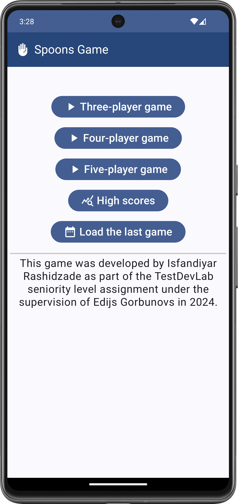
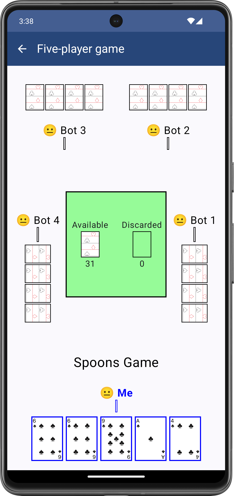
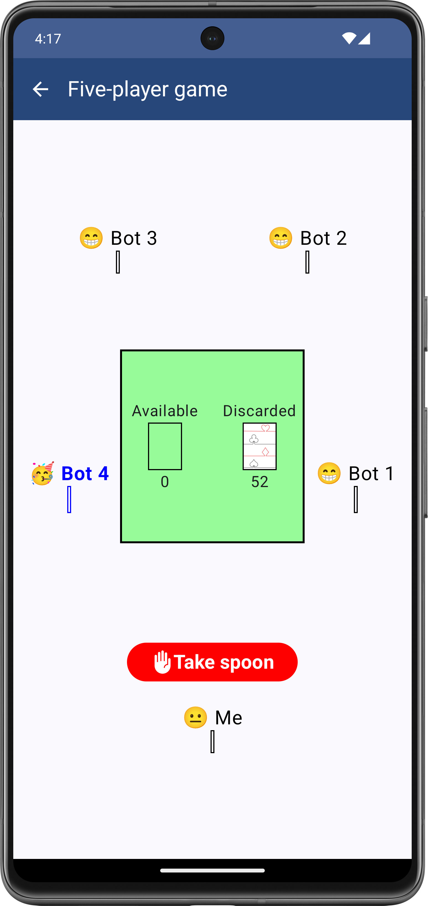
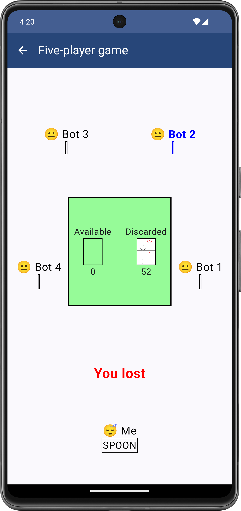
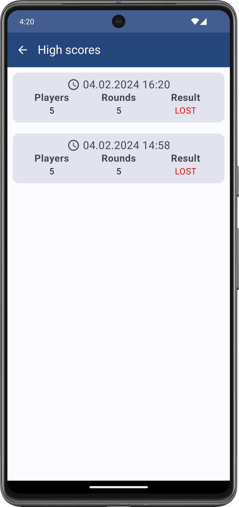

# Spoons Game - Android Application
## Introduction
The Spoons Game is a non-commercial and not-Play Store-published Android application which developed
by using Jetpack Compose. This game was developed by Isfandiyar Rashidzade in the scope of TestDevLab 
seniority level assignment. The assignment was given by Edijs Gorbunovs and completion duration
was two weeks.

The application was delivered in 5 February 2024

## About the Application
The game is mainly composed of menu, game play, high scores screens.

### Menu
The application starts with menu screen which contains 5 buttons;

- `Three-player game`: a user will start to play game with two bots.
- `Four-player game`: there will be three bots and a user.
- `Five-player `game`: there will be totally five players and four of them are bots.
- `High scores`: in this screen a user can find won and lost game records.
- `Load the latest game`: a user can continue to play the latest unfinished game.

### Play Game
The Spoons game is a card game in which players receive a letter from SPOON word
when loosing a round. The game can be played with 3,4 and 5 players.

When the game is started for first time a real user starts first. When new round starts, a new first
player chosen by the counter clock wise direction of previous round's first player.

The first player of each round draws a card from available deck cards 
and the the last player discards any card from hand to deck. When available cards are finished
the discarded cards are shuffled and added to available cards.
The other players always give card to next player. After discarding a card the player will have four cards.

A round is finished when a player will have four same suits (i.e. four Kings) after discarding 5th card. 
The player with four same suits is the winner of round. A player receives a letter according
to following rules when a round is finished.

- If The round winner is the real user then random bot receives a letter.
- If round winner is a bot and there are more than 2 players in round then
`Take spoon` button will appear on screen for 1 second.
  - If the real user will able to click the button then a random bot (except the winner)
  will receive a letter.
  - If the button is not clicked then the user receives a letter.
- If round winner is a bot and only 2 players left in round then the real user receives a letter.

A game is finished when a player will collect all letters of SPOON. 

- If the SPOON word collector is the real user then the game will be lost. 
- If the collector is a bot then the bot will be kicked from the game 
and next round will start with remaining players.
- If all bots will collect SPOON word then the real user wins the game.

### High Scores
In this section a user can see the round count and game result of a finished game.

### Play the Latest Game
The unfinished game is saved to database when back button is clicked or the application is closed.
The saved game can be reloaded by pressing the `Load the last game`.

## Reference
Card images was taken from:

- @hanhaechi https://github.com/hanhaechi/playing-cards/tree/master